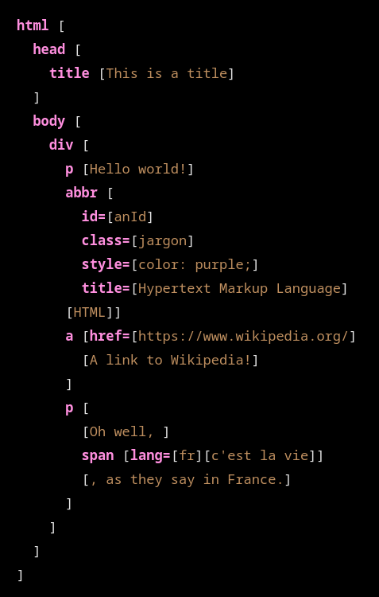

# jevko-basic-highlighting

Basic syntax highlighting support for Jevko in various environments.

## Visual Studio Code

The most basic possible syntax highlighting for Jevko that works in Visual
Studio Code.

See [this repository](https://github.com/jevko/jevko-basic-highlighting-vscode).

## KatePart Syntax Highlight System

The most basic possible syntax highlighting for Jevko that works with the
KatePart Syntax Highlight System is provided by this file:

[jevko-katepart.xml](jevko-katepart.xml)

It can be used for example to highlight Jevko syntax in Markdown with pandoc,
e.g.:

```
pandoc -f markdown --syntax-definition=jevko-katepart.xml file.md -s > out.html
```

To use, copy the file to a location of your choice and direct your tool to it
(e.g. as shown above).

Example screenshot:



## CodeMirror 6 language package for Jevko

See [this repository](https://github.com/jevko/codemirror6language).

## Known Issues

There is an unfixable bug in all line-oriented syntax highlighting environments
where only the lines that contain an opening bracket `[` in Jevko prefixes are
properly highlighted.

Other lines look the same as suffixes.

Here is an illustration:


In these environments the bug is impossible to workaround -- the fundamental
problem is the limitation of these environments which precludes defining tokens
that span multiple lines. For properly highlighting Jevko this is not sufficient
-- Jevko is not a line-oriented syntax.

The known line-oriented enviroments are:

- Visual Studio Code -- basic syntax highlighting via TextMate grammars
- KatePart Syntax Highlight System

Known environments that don't suffer from this limitation:

- Visual Studio Code -- semantic highlighting
- CodeMirror 6